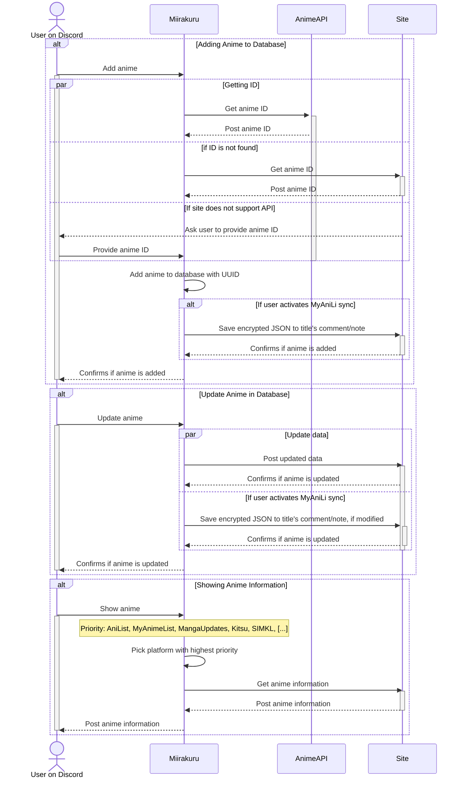

<!-- markdownlint-disable MD033 MD041 -->
<a href="hhtps://github.com/nattadasu/miirakuru"></a>

# Miirakuru 「ミイラクル」

[][lic]

[][ipy]
[][support]

Easily sync your Anime and Manga to several supported sites via Discord, only
for self-host!

## About

Miirakuru (Japanese: ミイラクル \[mʲiːꜜɾakɯɾɯ̥\], wordplay of Miracle「ミラクル」
and Mummy 「ミイラ」) is a Discord bot that assist you in tracking your currently
watching anime to MyAnimeList directly from Discord. It also able to sync to
multiple platforms thanks to [AnimeAPI][aniapi].

Build with [interactions.py][ipy], this bot uses slash command (`/`) as main
interface to the software instead of prefixed/text command.

Miirakuru **does not** have invitable link, and anyone who interested using it
must self-host this bot instead.

## Planned Features

### General

* [ ] MyAnimeList OAuth2 Authentication
* [ ] Auto Backup data
* [ ] Show anime information
* [ ] Update tracking data
* [ ] Logs activity
* [ ] Broadcast user activity to a channel from RSS/Atom
* [x] Better config management using YAML for secrets and TOML for general
      configurations.

### Anime Sync Databases

* **Main**
  * [ ] MyAnimeList
  * [ ] AniList
  * [ ] Kitsu
  * [ ] SIMKL
* **One-Way Sync**
  * [ ] aniDB
  * [ ] Annict
  * [ ] Bangumi
  * [ ] Shikimori
  * [ ] The Movie Database
  * [ ] Trakt
* **Experimental**
  * [ ] Kaize
  * [ ] LiveChart
  * [ ] Nautiljon
  * [ ] Notify.moe
  * [ ] Otak Otaku

### Manga Sync Databases

* **Main**
  * [ ] MyAnimeList
  * [ ] AniList
  * [ ] Kitsu
  * [ ] MangaUpdates
* **One-Way Sync**
  * [ ] Bangumi
* **Experimental**
  * [ ] Kaize
  * [ ] MangaDex

## Methodology

As each platform has different way to store their data and the assigned ID, this
becomes a challenge to sync the data between platforms. To solve this, Miirakuru
uses a method called **ID Mapping**.

In some situation, the ID from one platform can be used to get the ID from
another platform interchangeably. For example, the ID from MyAnimeList can be
used to get the ID from Shikimori, and vice versa. This is because Shikimori
retrieves their data from MyAnimeList.

However, this is not always the case. For example, the ID from MyAnimeList
cannot be used to get the ID from AniList, and vice versa. To solve this, we
need to use a third-party API to get the ID from another platform. If the
API does not support the platform, then we need to ask the user to provide the
ID from the platform by searching from the platform itself or provide the ID
from the platform.



## Set-Up

### Prerequisites

Before installing and running the software, you must have those required
packages/apps to be installed first:

1. [Git](https://git-scm.com)
2. [Python 3.10](https://www.python.org) or greater

Additionally, you can install [`pipenv`](https://github.com/pypa/pipenv) as
dependency manager instead of using `virtualenv` and `pip`.

## Cloning and Installing Required Packages

1. To make the software available on your machine, open Terminal and write as following:

   ```bash
   git clone https://github.com/nattadasu/miirakuru.git
   cd miirakuru
   ```

   Or, using [GitHub CLI](https://github.com/cli/cli):

   ```bash
   gh repo clone nattadasu/miirakuru
   cd miirakuru
   ```

2. Depending which dependency manager you use, install required packages
   * Using `pipenv`:

     ```ps1
     pipenv install
     ```

   * Using `virtualenv` and `pip`:

     ```bash
     python -m venv venv
     # depending on what OS and shell:
     # bash:
     source ./venv/bin/activate
     # PowerShell, Windows:
     #   & ./venv/Scripts/activate.ps1
     # PowerShell, *nix:
     #   & ./venv/bin/activate.ps1
     pip install -U -r requirements.txt
     ```

3. Copy `.env.example` as `.env`, and fill all fields

4. Run the software
   * Using `pipenv`:

     ```bash
     pipenv run main.py
     ```

   * [ ] Using `virtualenv`:

     ```bash
     python main.py
     ```

## License

This software is licensed under [GNU Affero General Public License v3.0][lic].

You can modify and redistribute this software as long as you follow the license
terms, and any modified version of this software must be released under the same
license.

## Acknowledgements

This software was inspired or made possible by the following:

* [infanf/myanili](https://github.com/infanf/myanili) &mdash; inspiration for
  this software to allows user to sync their main MyAnimeList list to other
  platforms
* [interactions.py][ipy] &mdash; the library used to build this bot
* [nattadasu/animeApi][aniapi] &mdash; the API used to get ID from other
* [nattadasu/ryuuRyuusei][ryuu] (especially rewrite version) &mdash; nattadasu's
  first bot, basically
* [YuuCorp/Yuuko][yuuko] and [White Cat][wc] &mdash; Bots that allow user to
  update their list (from AniList and MyAnimeList respectively) via Discord
  platforms

<!-- References -->
[aniapi]: https://github.com/nattadasu/animeApi
[ipy]: https://pypi.org/project/discord-py-interactions/
[lic]: LICENSE
[support]: https://discord.gg/UKvMEZvaXc
[yuuko]: https://github.com/YuuCorp/Yuuko
[wc]: https://whitecat.app
[ryuu]: https:/github.com/nattadasu/ryuuRyuusei
